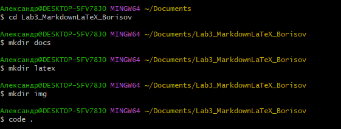

# Лабораторная работа №3: Работа с Markdown-разметкой и базовое использование LaTeX в документации проекта

## Краткое описание

Данная лабораторная работа посвящена изучению языка разметки Markdown и системы вёрстки LaTeX. В ходе работы были созданы документы, демонстрирующие различные возможности форматирования текста, создание списков, таблиц, вставки изображений, использования математических формул и дополнительных элементов Markdown.

---

## Содержание

- [Структура проекта](#структура-проекта)
- [Использованные технологии](#использованные-технологии)
- [Форматирование текста](#форматирование-текста)
- [Списки](#списки)
- [Цитата](#цитата)
- [Блок кода](#блок-кода)
- [Таблица](#таблица)
- [Изображение](#изображение)
- [Ссылки](#ссылки)
- [Чекбоксы](#чекбоксы)
- [Сноска](#сноска)
- [Alert-блоки](#alert-блоки)
- [LaTeX формулы](#latex-формулы)

---

## Структура проекта

Lab3-MarkdownLaTeX_Иванов_ИИ/

*   README.md
*   docs/
    *   headersLab3_ФИО.md
    *   separatorsLab3_ФИО.md
    *   formattingLab3_ФИО.md
    *   listsLab3_ФИО.md
    *   linksImagesLab3_ФИО.md
    *   codeQuotesLab3_ФИО.md
    *   tablesLab3_ФИО.md
    *   advancedMarkdownLab3_ФИО.md
    *   latexLab3_ФИО.md
*   latex/
*   img/
    *   gitPushLab3_ФИО.png
    *   headersCommitLab3_ФИО.png

---

## Использованные технологии

| Технология | Назначение | Пример |
|:----------:|:----------:|--------|
| **Markdown** | Разметка документации | `# Заголовок` |
| **LaTeX** | Математические формулы | `$E = mc^2$` |
| **Git** | Контроль версий | `git commit` |
| **GitHub** | Хостинг репозитория | `git push` |

---

## Форматирование текста

- **полужирный**
- *курсив*
- ~~зачёркнутый~~
- `моноширный`

---

## Списки

- маркированный
- нумерованный
- вложенный

1. Markdown
   - Заголовки
   - Списки
   - Таблицы
2. LaTeX
   - Inline формулы
   - Блочные формулы

---

## Цитата

> Git — это распределённая система контроля версий, созданная Линусом Торвальдсом для разработки ядра Linux.

---

## Блок кода

```csharp
using System;

class Program
{
    static void Main()
    {
        Console.WriteLine("Hello, World!");
    }
}
```
# Таблица

| Столбец 1 | Столбец 2 | Столбец 3 |
|-----------|-----------|-----------|
| Значение 1 | Значение 2 | Значение 3 |
| Данные 4 | Данные 5 | Данные 6 |

---

## Изображение



---

## Ссылка

[GitHub](https://github.com)

---

## Чекбоксы

- [ ] Task 1
- [ ] Task 2

---

## Списки

- маркированный
- нумерованный
- вложенный

1. Markdown
   - Заголовки
   - Списки
   - Таблицы
2. LaTeX
   - Inline формулы
   - Блочные формулы
## Сноска

Текст[^1]

[^1]: Примечание

---

## Alert-блоки

> [!NOTE]
> Это простая заметка.

> [!TIP]
> Полезный совет.

> [!WARNING]
> Предупреждение.

---

## Inline LaTeX

Площадь круга: $S = \pi r^2$

## Block LaTeX

$$
\sum_{i=1}^n i = \frac{n(n+1)}{2}
$$