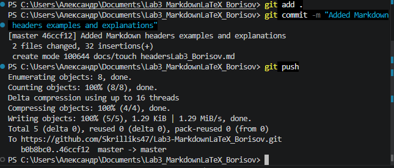

# Ссылки и изображения в Markdown

## Внешние ссылки

- [GitHub](https://github.com) — платформа для хостинга IT-проектов
- [Markdown Guide](https://www.markdownguide.org) "Официальный гид по Markdown"
- [LaTeX Project](https://www.latex-project.org) "Документация по LaTeX"

## Локальные изображения

### Скриншот пуша на GitHub

### Скриншот коммита с заголовками

## Внутренние ссылки

- [Перейти к заголовкам](headersLab3_Borisov.md)
- [Перейти к спискам](listsLab3_Borisov.md)